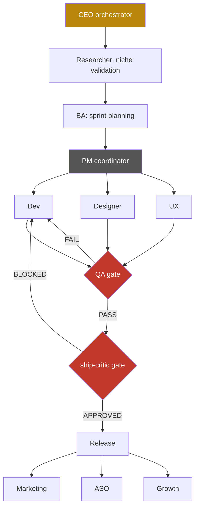

# Pipeline

## The org chart

Solid arrows are the normal forward handoff. `QA` and `ship-critic` are drawn as gates (diamonds, red) because they are the two points in the pipeline that can send work backward instead of forward — everything else only moves the work along.

## Prose walkthrough

**CEO** is the top-level orchestrator. It doesn't write code or touch the App Store API — it reads the portfolio's current state, decides what the highest-leverage next move is, and routes the goal to the right specialist. For a brand-new app idea, that's Researcher first; for "ship the update I already built," it skips straight to PM.

**Researcher** validates that an idea is worth building before any code exists. It scores a niche on market size, competition, data availability, and recurring demand, then produces a confidence score and a go/no-go call. Below a minimum confidence threshold, the answer is "don't build this" — the whole point of putting Researcher first is to make that a cheap decision instead of an expensive one made after weeks of Dev work.

**BA** turns a validated idea (or an existing backlog) into a focused sprint plan: a small number of prioritized tasks, ranked by rejection-fix > bug-fix > revenue-impact > polish > new-feature, sized for what one person can actually ship in a short cycle.

**PM** is the single entry point for everything downstream of planning. Every "ship this," "fix this," or "build this" goal flows through PM, which decomposes it and dispatches to Dev, Designer, UX, QA, and Release in the right order, tracking where each app sits in the pipeline so agents don't have to rediscover state from scratch. PM runs every phase as a **do-until-pass loop**: a specialist executes, an independent reviewer checks the output, and on failure the specialist gets the fail reasons back and retries — the same agent never reviews its own work.

**Dev, Designer, and UX** build in parallel where possible. Dev handles the actual compilation and code; Designer defines the screens, flows, and visual system before code is written; UX reviews the result against accessibility and platform-guideline standards. All three feed into QA.

**QA is the first mandatory gate.** Nothing reaches Release without a QA pass — no exceptions, regardless of how small the change looks. QA's highest-priority check is a persona test: install fresh, as a real user would, and confirm the app doesn't show a blocking error screen, that the thing being sold is findable within a normal user's patience, and that the purchase flow actually completes in a sandbox environment. A clean compile is necessary but proves nothing about any of that.

**ship-critic is the second mandatory gate**, and it exists specifically to distrust the first one. It is a cynical, adversarial reviewer with a structural bias toward blocking, invoked right before any store submission — including submissions QA has already passed and Release has already prepared. Its working assumption is that unanimous prior approval (Dev says done, QA says pass, Release says ready) is itself a warning sign, not a green light, because every upstream agent has a built-in incentive to declare success. ship-critic reconciles what was *promised* (the platforms and features claimed) against what's *actually delivered* (the live state of the submission), and returns exactly one concrete next action — never a vague "looks mostly ready."

**Release** only runs after both gates pass. It handles the actual store submission mechanics: attaching builds, verifying in-app purchase readiness, checking for orphaned submissions, and — critically — treating the entire submission as one atomic operation that must complete in a single session rather than being left half-done across multiple sessions.

**Marketing, ASO, and Growth** run after release, often in parallel: ASO tunes store listing keywords and metadata per market, Marketing produces launch content and landing pages, and Growth owns the paywall, retention mechanics, and monetization tuning based on real usage data once the app has actual users.

## The two gates, restated

| Gate | Runs after | Blocks | Bias |
|---|---|---|---|
| **QA** | Dev / Designer / UX | Release | Toward finding a reason the build isn't actually done |
| **ship-critic** | Release preparation, before submission | The actual store submission | Toward BLOCKED — treats "everyone already approved this" as suspicious, not reassuring |

Both gates can send work backward to Dev. Neither gate can be skipped by an upstream agent's confidence in its own work — that confidence is exactly what the gates exist to test.
